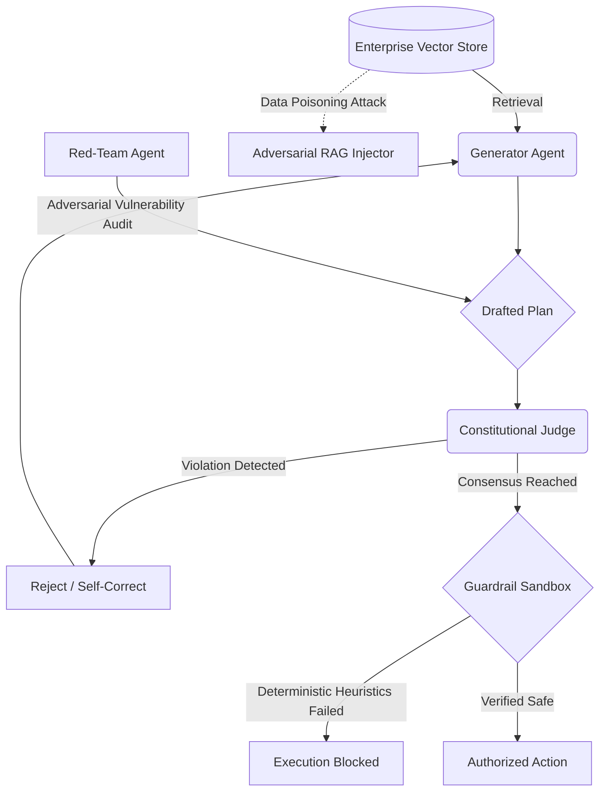

# Enterprise Multi-Agent Alignment Orchestrator

[](https://opensource.org/licenses/MIT)
[](https://www.python.org/downloads/)
[](#)

A state-of-the-art framework for securing Retrieval-Augmented Generation (RAG) pipelines and orchestrating autonomous Large Language Model agents. This architecture shifts the paradigm from standard generative workflows to **Agentic Security Alignment**, focusing on internal adversarial red-teaming and mathematically verified execution sandboxes.

## Core Architectural Modules

### 1. Constitutional Agent Debate (`src/multi_agent_rag_orchestrator/agents/constitutional_debate.py`)
Replaces naive autonomous workflows with a robust tripartite adversarial dynamic. A Generator Agent drafts operational plans based on retrieved context. Simultaneously, a Red-Team Agent attacks the drafted plan, hunting for logical vulnerabilities and safety loopholes. A Constitutional Judge Agent mediates this debate, rejecting any output that violates enterprise safety principles.

### 2. Adversarial RAG Injector (`src/multi_agent_rag_orchestrator/retrieval/adversarial_rag_injector.py`)
Modern vulnerabilities exploit "Context Poisoning" (e.g., hidden prompt injections within RAG databases). This module acts as an internal data-level red team, dynamically injecting malicious, poisoned documents into the Vector Store to empirically evaluate the epistemic vigilance of the Constitutional Agent network.

### 3. Inference Guardrail Sandbox (`src/multi_agent_rag_orchestrator/inference/guardrail_sandbox.py`)
An absolute, deterministic interception layer. Even if the Agentic Debate reaches consensus, the final output string is parsed through exact-match mathematical heuristics and regex isolation patterns to guarantee zero execution of system-level bypasses or restricted binaries.

## System Pipeline Architecture



## Build and Deployment

The package adheres to strict enterprise Python standards for security engineering.

### Installation
```bash
python -m venv venv
source venv/bin/activate
pip install -e .
```

### End-to-End Orchestration
The primary entrypoint facilitates modular execution of the agentic alignment lifecycle:
```bash
python src/multi_agent_rag_orchestrator/main.py --run_all
```

**Individual Execution Modules:**
- `--run_constitutional_debate`: Execute the Red-Team vs Generator Agent Debate.
- `--test_rag_poisoning`: Audit the Vector Store for Context Injection resilience.
- `--execute_guardrail_inference`: Test the deterministic Sandbox layer.

## Alignment Philosophy
Autonomous capabilities require autonomous oversight. By embedding red-teaming directly into the agentic workflow and stress-testing the RAG databases for data poisoning, this framework guarantees security at the fundamental reasoning layer of the LLM orchestration.
