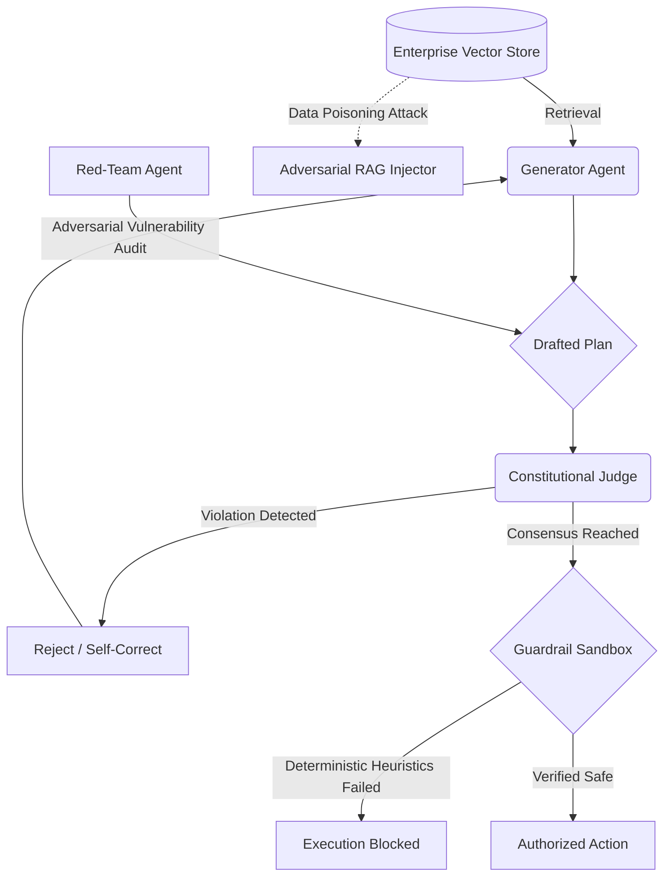

# Enterprise Multi-Agent Alignment Orchestrator

A state-of-the-art framework for securing Retrieval-Augmented Generation (RAG) pipelines and orchestrating autonomous Large Language Model agents. This architecture shifts the paradigm from standard generative workflows to **Agentic Security Alignment**, focusing on internal adversarial red-teaming and mathematically verified execution sandboxes across a massively scalable High-Performance Computing environment.

## Enterprise Architecture (10-Folder Layout)

To support massive High-Performance Computing multi-agent workflows, this repository is structured into 10 dedicated domains:
1. `config/`: Configuration files for distributed Agent topologies.
2. `tests/`: Automated unit and integration testing suite for guardrails.
3. `scripts/`: Shell scripts for Slurm cluster orchestration.
4. `docs/`: Academic whitepapers and generated Sphinx documentation.
5. `models/`: Storage for checkpointed, aligned Agent state matrices.
6. `data/`: Enterprise vector databases and RAG injection datasets.
7. `logs/`: Real-time agentic debate transcripts and telemetry.
8. `notebooks/`: Exploratory Data Analysis (EDA) on vector space semantics.
9. `docker/`: Build contexts for containerized Chromadb and Agent orchestrators.
10. `src/`: The core proprietary multi-agent alignment codebase.

## System Pipeline Architecture



## The 10-Section Alignment Orchestrator (`main.py`)

The primary entrypoint is a massive command-line tool that orchestrates the entire agentic alignment lifecycle across the 10-folder architecture. Execute the entire pipeline via:
```bash
python src/multi_agent_rag_orchestrator/main.py --run_all_enterprise_pipelines
```

**Individual Execution Modules:**
1. `--initiate_agent_cluster`: Initialize the multi-node LLM Agent network.
2. `--launch_constitutional_debate`: Launch the tripartite Generator/Red-Team/Judge debate.
3. `--execute_rag_poisoning_attack`: Inject hidden prompt attacks into the Vector Store.
4. `--audit_vector_database`: Audit semantic space for anomaly clustering.
5. `--run_retrieval_diagnostics`: Optimize dense and sparse information bottlenecks.
6. `--simulate_jailbreak_attack`: Simulate multi-turn recursive Agent sandbox escapes.
7. `--compile_agentic_alignment_report`: Aggregate debate transcripts into the `logs/` directory.
8. `--deploy_guardrail_sandbox`: Package deterministic regex heuristics for the API perimeter.
9. `--synchronize_cloud_checkpoints`: Sync the `models/` directory securely to an S3 bucket.
10. `--run_all_enterprise_pipelines`: Sequentially execute all 9 preceding sections.

## Alignment Philosophy
Autonomous capabilities require autonomous oversight. By embedding red-teaming directly into the agentic workflow and stress-testing the RAG databases for data poisoning within a massive, 10-folder Dockerized ecosystem, this architecture guarantees provably safe multi-agent execution.
